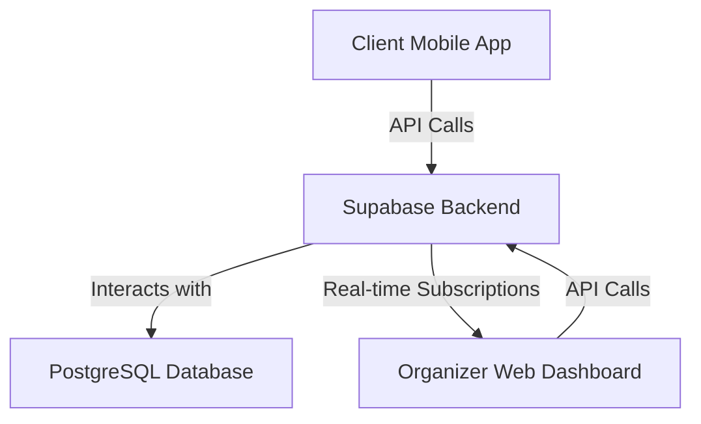

Here is the complete content for the `rules/system.md` file, generated based on the architectural decisions provided for the **ClientSync Travel Platform**. This document serves as the single source of truth for the project's architecture, design patterns, and technical guidelines, ensuring clarity and actionability for the development team.


# System Architecture & Design Patterns (`rules/system.md`)

**This document is the canonical source for the project's system architecture, design patterns, and technical guidelines. All development work must align with the principles and structures outlined herein. Deviations require explicit approval and documentation.**

## 1. Overall Architecture Philosophy

The **ClientSync Travel Platform** adopts a **Modular Monolith** architecture, structuring the system as a single application with distinct modules for the mobile app, web dashboard, and backend. This design choice emphasizes simplicity in deployment and maintenance, tailored to support 500 concurrent users without the overhead of microservices. The system is housed within a monorepo using PNPM workspaces, enabling efficient code sharing and dependency management across its components.

### High-Level Architecture Diagram



This diagram outlines the primary components:
- **Client Mobile App**: Connects to Supabase for data operations.
- **Organizer Web Dashboard**: Interfaces with Supabase and leverages real-time subscriptions for updates.
- **Supabase Backend**: Manages data storage, authentication, and custom functions.
- **PostgreSQL Database**: Stores core data such as clients, trips, and allowlists.

## 2. Backend System Patterns

### 2.1. Core Backend Architecture

The backend employs a **Serverless Architecture** via Supabase, offering:
- Scalability through automatic scaling.
- Real-time functionality with subscriptions.
- Integrated authentication and database management.

This approach minimizes infrastructure management, allowing focus on feature development.

### 2.2. Key Backend Design Patterns

1. **Repository Pattern**:
   - **Purpose**: Centralizes data access logic.
   - **Application**: Implemented in `services/api.ts` to streamline Supabase interactions, ensuring consistent CRUD operations.

2. **Service Layer Pattern**:
   - **Purpose**: Encapsulates business logic.
   - **Application**: Manages API calls and data processing within the `services/` directory, enhancing reusability.

3. **Observer Pattern**:
   - **Purpose**: Responds to state changes.
   - **Application**: Facilitates alerts in the web dashboard through Payload webhooks or polling mechanisms.

### 2.3. Backend Component Relationships & Flows

- **Custom Endpoints**: Handle specific frontend requests (e.g., allowlist verification, email sending).
- **Data Flow**: Frontend services invoke Payload CMS APIs, which interact with the PostgreSQL database.

### 2.4. Backend Module/Directory Structure

```plaintext
packages/cms/
├── src/
│   ├── collections/      # Payload collections (data models)
│   ├── components/       # Admin UI components
│   ├── endpoints/        # Custom API endpoints
│   ├── access/          # Access control functions
│   └── hooks/           # Collection hooks
└── payload.config.ts    # Payload configuration
```

- **collections/**: Defines data models (Clients, Trips, Preferences, etc.)
- **endpoints/**: Contains custom API endpoints for business logic
- **hooks/**: Collection-level hooks for data validation and processing

## 3. Frontend System Patterns

### 3.1. Core Frontend Architecture

The frontend is divided into two distinct applications:
- **Mobile App**: Utilizes React Native with Expo, adopting a component-based architecture and Expo Router for navigation.
- **Web Dashboard**: Built with React and Vite, structured as a component-based Single Page Application (SPA).

### 3.2. Key Frontend Technical Decisions & Patterns

- **State Management**: Employs React hooks for local state; global state may use Context API or Zustand if required.
- **Routing**: Expo Router for mobile, React Router for web.
- **API Communication**: Centralized in `services/api.ts` via the Repository Pattern.
- **Component Design**: Reusable components stored in `ui/` (mobile) or `components/` (web).

### 3.3. Frontend Component Relationships & Structure

- **Mobile App**:
  - **Screens** (e.g., `app/login.tsx`) assemble **Components** (e.g., `ui/Text.tsx`).
  - **Services** (`services/api.ts`) manage data interactions.
  - **Navigation**: Handled by Expo Router within `app/`.

- **Web Dashboard**:
  - **Pages** (e.g., `Dashboard.tsx`) render **Components** (e.g., `ClientList.tsx`).
  - **Services** (`services/api.ts`) retrieve data from Supabase.

### 3.4. Critical Frontend Implementation Paths/Flows

- **Mobile App**:
  1. Email verification.
  2. Onboarding flow.
  3. Itinerary viewing.
- **Web Dashboard**:
  1. Client overview.
  2. Real-time alerts.
  3. Allowlist management.

## 4. Cross-Cutting Concerns & Platform-Wide Patterns

- **Error Handling**:
  - Centralized in `services/api.ts` for API calls.
  - Displays user-friendly messages in the UI.
- **Logging**:
  - Server-side logging via Payload CMS hooks and middleware.
  - Client-side logging for debugging (e.g., console logs in development).
- **Validation**:
  - Frontend validation for user inputs.
  - Backend validation using Payload collection validation and access control.
- **Security**:
  - Authentication managed by Payload CMS with JWT tokens.
  - Email allowlist for verification.
  - End-to-end encryption for sensitive data.
- **Configuration Management**:
  - Environment variables for settings.
  - Payload CMS configuration via payload.config.ts.
- **API Design Principles**:
  - Follows RESTful conventions via Payload CMS APIs.
  - Versioning considered for future scalability.
- **Testing Strategy**:
  - Unit tests for components and services.
  - Integration tests for data flows.
  - End-to-end tests for critical user journeys.

## 5. Key Technology Stack Summary

- **Frontend**:
  - JavaScript/TypeScript
  - React Native (Expo) for mobile
  - React (Vite) for web
  - Tailwind CSS for styling
- **Backend**:
  - TypeScript with Payload CMS
  - Next.js-based CMS with REST/GraphQL APIs
- **Database**:
  - PostgreSQL (managed by Payload CMS)
- **Tools**:
  - PNPM for package management
  - Git for version control
  - Expo and Vite for development and builds

---

*This document should be reviewed and updated as the system evolves.*

